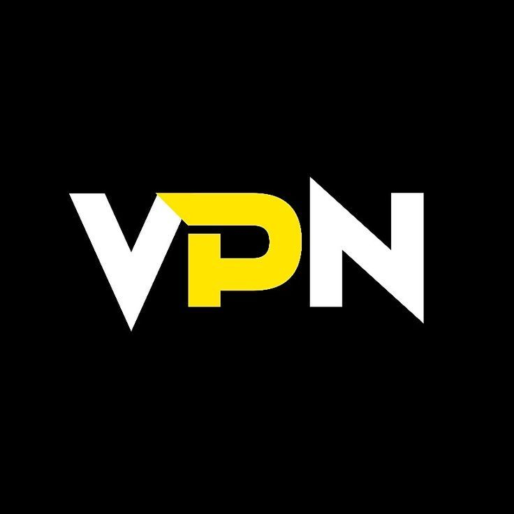

# 🛡️ VPN-Pro-Bot

## 🇬🇧 English

VPN-Pro-Bot is a Discord-based VPN and server-protection project.

The project is designed to provide VPN access through keys generated by the bot. These keys can be used with compatible VPN clients and services to connect through the project's VPN infrastructure.

The bot also provides security and protection features designed to help protect Discord servers.

### 🚧 Development Status

VPN-Pro-Bot is still under active development.

More updates, improvements, security features, compatibility updates, and new features are planned for future releases.

The project is **not guaranteed to work immediately for every user, device, VPN client, or environment**. Compatibility and configuration may vary while development continues.

---

## 🇪🇬 العربية

**VPN-Pro-Bot** هو مشروع يعتمد على Discord لتوفير خدمات VPN وميزات حماية للسيرفرات.

المشروع مصمم لتوفير إمكانية الوصول إلى VPN من خلال مفاتيح يتم إنشاؤها بواسطة البوت. ويمكن استخدام هذه المفاتيح مع عملاء وخدمات VPN المتوافقة للاتصال من خلال البنية التحتية الخاصة بالمشروع.

كما يوفر البوت ميزات أمنية وحماية تهدف إلى المساعدة في حماية سيرفرات Discord.

### 🚧 حالة التطوير

المشروع **لا يزال قيد التطوير**.

هناك المزيد من التحديثات والتحسينات وميزات الحماية وتحسين التوافق والميزات الجديدة المخطط إضافتها في الإصدارات القادمة.

المشروع **لا يضمن أن يعمل مباشرة مع كل مستخدم أو جهاز أو برنامج VPN أو بيئة تشغيل**، وقد تختلف طريقة الإعداد والتوافق أثناء استمرار التطوير.

---

## 🖼️ Project Preview

---

## 📜 License

This project is licensed under the NΞXUS Open Software License (NOSL) 1.0 Final Candidate.

هذا المشروع مرخص بموجب NΞXUS Open Software License (NOSL) 1.0 Final Candidate.

License:
https://github.com/asdasder456123/NEXUS-XS-License

NOSL 1.0 is currently a Final Candidate under external review and is not OSI-approved.
